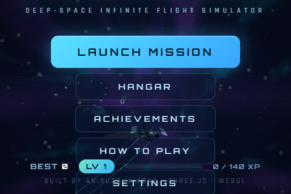
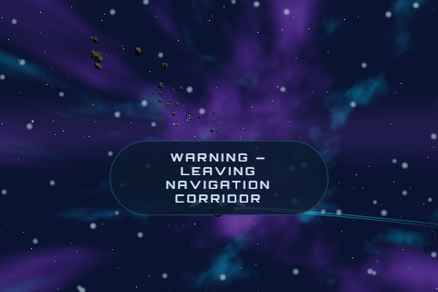
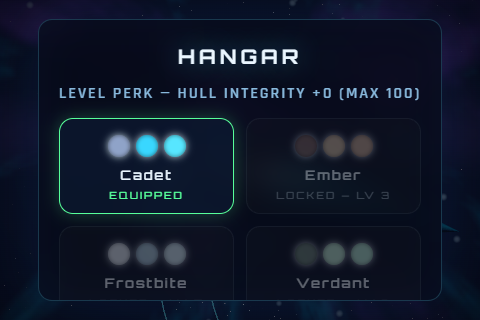

# VOIDRUNNER

**A deep-space infinite flight simulator.** Pilot a starfighter through an endless, procedurally-generated universe — threading asteroid fields, slingshotting past ringed planets, and escaping the gravitational pull of black holes that will consume you if you drift too close.

Built from scratch with **Three.js**, **WebGL**, custom GLSL shaders, procedural geometry/textures, and a fully synthesized WebAudio soundscape. No downloaded assets. No build step. Runs anywhere a browser runs.

<p align="center">
  <b>PLAY LIVE → <a href="https://voidrunner-neon.vercel.app">https://voidrunner-neon.vercel.app</a></b>
</p>

<p align="center">
  
  
  
</p>

---

## Table of Contents

- [Gameplay](#gameplay)
- [Controls](#controls)
- [Scoring & Rewards](#scoring--rewards)
- [Hazards & Survival Constraints](#hazards--survival-constraints)
- [Feature Highlights](#feature-highlights)
- [Tech Stack & Architecture](#tech-stack--architecture)
- [Project Structure](#project-structure)
- [Run Locally](#run-locally)
- [Performance & Quality Tiers](#performance--quality-tiers)
- [Browser Support](#browser-support)
- [Roadmap](#roadmap)
- [Credits & License](#credits--license)

---

## Gameplay

VOIDRUNNER is an infinite runner in three dimensions. Your ship flies forward automatically through a corridor of deep space; you control its lateral movement, throttle, and evasive maneuvers while the universe streams toward you.

Every run is different. A weighted spawn director generates patterns across five difficulty tiers that ramp with distance:

| Pattern | Description |
|---|---|
| **Asteroid Fields** | Scattered tumbling rocks with independent drift and rotation |
| **Asteroid Walls** | A full grid of rock blocking the corridor — one gap, find it |
| **Crystal Trails / Rings** | Sinusoidal chains and circular formations of void crystals |
| **Boost Gates** | Torus gates that award bonuses and refill power |
| **Planets** | Procedurally-textured worlds — gas giants with rings and moons at the corridor's edge, dwarf planets as lethal obstacles inside it |
| **Black Holes** | Gravity wells with physically-scaled pull (`F ∝ 1/d²`) — escape them for bonus points, cross the event horizon and be consumed |

Distance increases base velocity from 46 to 138 units/s. Spawn density, wall tightness, and black hole frequency all scale with tier.

## Controls

Designed so **everything is reachable with the mouse alone** on desktop, or a single thumb on mobile.

| Action | Mouse | Keyboard (optional) | Mobile / Touch |
|---|---|---|---|
| Steer | Move cursor (reticle marks heading) | WASD / Arrow keys | Drag anywhere — relative virtual stick |
| Boost (afterburner) | Hold Left Click | `Shift` | Hold BOOST button |
| Air brake | Hold Right Click | `S` / `Ctrl` | Hold BRK button |
| Barrel roll dodge | Middle Click | `Space` | Tap ROLL button |
| Pause | Pause button | `P` / `Esc` | Pause button |
| Audio toggle | Audio button | `M` | Audio button |

Additional mechanics bound to controls:

- **Barrel roll**: 360° roll with a lateral impulse and ~0.65s of invulnerability. 1.7s cooldown.
- **Boost**: 1.8× speed, drains power at 26/s. Coasting regenerates 11/s.
- **Brake**: 0.42× speed for threading tight gaps.

## Scoring & Rewards

| Event | Reward |
|---|---|
| Distance | Continuous: `speed × Δt × multiplier` |
| Void Crystal | +150 × multiplier (magnetically attracted within range) |
| Boost Gate | +350 × multiplier, +16 power |
| Near Miss | +75 × multiplier |
| Gravity Well Escape | +400 × multiplier |
| Hull damage | Combo resets to x1 |

The combo multiplier grows with every pickup/gate/near-miss chain up to **x5**.

### Progression

- Score converts to **XP** at end of run (`score/60 + crystals×2 + gates×6 + near-misses`).
- Levels persist via `localStorage`, unlocking **7 ship skins** (Cadet, Ember, Frostbite, Verdant, Pulse, Voidwalker, Aurum) equipable in the Hangar with live 3D preview.
- Every level adds **+5 max hull** (capped at +60).
- **10 achievements** tracked, from *First Flight* to *Event Horizon* (escape a black hole) and *Untouchable* (25k score without hull damage).

## Hazards & Survival Constraints

1. **Hull integrity** — asteroids and planets deal impact damage; slow self-repair kicks in after 4.5s without damage. At 0 the run ends.
2. **Black holes** — inverse-square gravity bends your trajectory inside their influence radius. Warning banner, klaxon, and camera shake escalate as you approach. The event horizon is fatal.
3. **Edge field** — the navigation corridor has soft boundaries. Pushing ~12 units past them burns hull every half-second.
4. **Power economy** — boost is finite; gates and coasting refill it.

## Feature Highlights

**Rendering**
- Custom GLSL: fbm-noise nebula skybox, black-hole accretion disk shader, planet atmosphere fresnel shells, procedural planetary ring shaders
- Infinite parallax starfield and speed-reactive dust implemented entirely in vertex shaders (position wrapping around the camera — no float-precision decay, ever)
- UnrealBloom post-processing pipeline with HalfFloat render targets and MSAA samples
- ACES filmic tone mapping

**Simulation**
- Chase camera with exponential smoothing, velocity lead, FOV kick on boost, trauma-based screen shake, and banking-follow roll
- Object-pooled entity system with zero per-frame allocations in the hot path
- Treadmill world motion — ship stays near origin, eliminating floating-point drift on infinite runs

**Presentation**
- Fully procedural ship model (extruded delta wings, canopy, twin engines with flickering glow), engine trail ribbons
- Canvas-procedural planet textures, atmospheres, rings, orbiting moons
- Live attract mode — menus float over the actual game simulating itself behind glass panels
- Functional HUD: canvas radar with threat classification blips and radar sweep, hull/power bars, combo chip, projected 3D score popups
- Complete WebAudio synthesis: throttled engine (oscillator + filtered noise wind), pitch-rising pickup arpeggios tied to combo, gate chords, explosion noise bursts, proximity alarm LFO, ambient drone pad

**Platform**
- Responsive from phones to ultrawide desktops, safe-area aware
- Unified Pointer Events input with multi-touch steering + button concurrency
- Auto quality detection; manual override in settings
- Persistent saves, pause-on-tab-blur, fullscreen support, PWA-friendly meta tags

## Tech Stack & Architecture

- **Three.js r160** (ES modules via import map — no bundler required)
- Vanilla ES2022 JavaScript, zero frameworks
- Post-processing: RenderPass → UnrealBloomPass → OutputPass

```
index.html          Entry point, import map, all UI layers/DOM overlays
css/style.css       Full UI system: HUD, menus, hangar, animations, responsive rules
js/main.js          Bootstrap, state machine (attract/count/play/pause/over),
                    flight physics, input aggregation, camera, scoring, run lifecycle
js/world.js         Spawn director, entity pools, pattern generators,
                    collision/gravity/near-miss systems, radar feed
js/fx.js            Shader starfield, dust, nebula skybox
js/fx2.js           Explosion/shockwave pools, engine trail ribbons
js/ship.js          Procedural fighter model + skin system
js/ui.js            DOM layer manager, HUD updates, radar renderer,
                    hangar/achievement panels, popups, XP animations
js/audio.js         WebAudio synthesizer: engine, SFX, alarm, music pad
js/save.js          Persistence, XP curve, skin/achievement catalogs
test-headless.mjs   Puppeteer E2E suite (boot, menus, gameplay, pause, audio)
docs/               Screenshots
```

## Run Locally

Any static file server works — ES modules require HTTP (not `file://`):

```bash
cd voidrunner
python -m http.server 8080
# or
npx serve .
```

Open `http://localhost:8080`.

### Automated E2E Test

A headless-browser test suite drives the real game — boots the engine, opens every menu, launches a run, steers/boosts via synthetic mouse input, and asserts scoring, pause/resume, and audio toggle with zero console errors:

```bash
npm install
npm test
```

Requires Edge (configurable path in `test-headless.mjs`). Runs against a local server on a software-GL renderer.

`npm run test:live` runs the same smoke suite against the production deployment.

## Performance & Quality Tiers

| Tier | Pixel Ratio | Bloom | MSAA | Stars/Dust | Default For |
|---|---|---|---|---|---|
| Low | 1.0 | off | 0 | reduced | weak GPUs |
| Medium | ≤1.5 | 0.65 strength | 0 | mobile counts | touch devices (auto) |
| High | ≤2.0 | 0.85 strength | 4x | full | desktop (auto) |

Quality auto-selects by pointer type; override anytime in Settings. Entity pooling keeps frame times flat regardless of run length.

## Browser Support

Chrome/Edge 90+, Firefox 90+, Safari 15+ (desktop & iOS). Requires WebGL. Audio unlocks on first interaction per browser autoplay policy.

## Roadmap

- Global leaderboard (Vercel Functions + Redis)
- Async ghost racing against your best runs
- Weapon systems and destructible asteroids
- Gamepad API support

## Credits & License

Built by **[Aniruddha Adak](https://github.com/aniruddhaadak80)** · AI Agent Engineer / Full-Stack Developer

- Rendering: [Three.js](https://threejs.org) (MIT)
- All game code, shaders, procedural assets, audio synthesis, and design: original work

Licensed under the MIT License.
